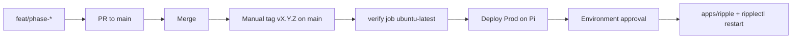

# Pi deploy (Phase 4)

How Ripple runs in **Prod** on the Raspberry Pi self-hosted runner.

## Architecture

| Piece | Location / name |
| --- | --- |
| Runner user | `github-runner` |
| Runner install | `/home/github-runner/actions-runner` |
| Job workspace | `/home/github-runner/actions-runner/_work` (ephemeral) |
| Live app | `/home/github-runner/apps/ripple` |
| systemd unit | `ripple.service` (`User=github-runner`) |
| Restart helper | `/usr/local/sbin/ripplectl` (sudoers-limited) |
| Deploy | One workflow: verify on `ubuntu-latest`, deploy on self-hosted ([`.github/workflows/deploy-prod.yml`](../.github/workflows/deploy-prod.yml)) |



## One-time GitHub setup

### 1. Environment `Prod`

Repo → **Settings → Environments → New environment** → name: `Prod`

This repo already has Environment **`Prod`** (with required reviewer). Confirm:

- Required reviewers: you
- Deployment branch/tag policy: allow tags matching `v*` (add a custom tag rule `v*` if the list is empty)

### 2. Environment secrets (source of truth) — you must paste these

| Secret | Required |
| --- | --- |
| `DISCORD_TOKEN` | yes |
| `DISCORD_CLIENT_ID` | yes |
| `OWNER_IDS` | recommended (comma-separated snowflakes) |
| `APEX_API_KEY` | if using Apex |
| `SPOTIFY_CLIENT_ID` | if using Spotify |
| `SPOTIFY_CLIENT_SECRET` | if using Spotify |

Do **not** put Prod secrets in Repository secrets.

Leave `DEV_GUILD_ID` unset in Prod (deploy workflow never writes it).

### 3. Environment / repository variables (optional)

| Variable | Default | Notes |
| --- | --- | --- |
| `APP_DIR` | `/home/github-runner/apps/ripple` | Override only if you relocated the app |
| `LOG_LEVEL` | `info` | |
| `FFMPEG_PATH` | `ffmpeg` | |
| `YTDLP_PATH` | `yt-dlp` | |
| `YTDLP_COOKIES_PATH` | _(empty)_ | Path on the Pi if you use a cookie jar |

### 4. Branch protection on `main`

- Require a pull request
- No direct pushes
- Optionally require linear history

Quality gates run at tag time inside the Deploy Prod `verify` job (not on every PR).

## One-time Pi setup

Templates live in [`deploy/`](../deploy/).

1. Install **Node.js 24** (arm64), enable Corepack, activate `pnpm@10.14.0`
2. Install **ffmpeg** and a current **yt-dlp** (prefer upstream/pipx over a stale distro package)
3. Create `/home/github-runner/apps/ripple` owned by `github-runner`
4. Install [`deploy/ripple.service`](../deploy/ripple.service) → `/etc/systemd/system/ripple.service`
5. Install [`deploy/ripplectl`](../deploy/ripplectl) → `/usr/local/sbin/ripplectl` (mode `755`, root)
6. Install sudoers drop-in from [`deploy/ripple-runner.sudoers`](../deploy/ripple-runner.sudoers) via `visudo -f`
7. `systemctl daemon-reload && systemctl enable ripple.service` (start happens on first deploy)
8. Confirm as `github-runner`:
   - `sudo -n /usr/local/sbin/ripplectl status`
   - Negative: `sudo -n /usr/bin/systemctl reboot` must fail

See [`deploy/provision-pi.sh`](../deploy/provision-pi.sh) for the scripted form (run with care; review before executing).

### Disk hygiene

- Keep a **single** app tree under `apps/ripple` (deploys rsync in place; `data/` and `.env` are preserved)
- Deploy workflow runs `pnpm store prune` and removes checkout `node_modules`/`dist`
- Delete leftover installer tarballs (e.g. unused `actions-runner-*.tar.gz` under the runner home) after the runner is installed
- Fail deploys when free space on `/` is under ~2 GB

## Versioning and lifecycle

### Cut a release (manual tag)

1. Merge work to `main` via PR
2. Optionally bump `package.json` `version` in that PR (keep it in sync with the tag)
3. Tag from `main` and push:

```bash
git checkout main && git pull
git tag -a v0.2.0 -m "Release v0.2.0"
git push origin v0.2.0
```

4. **Deploy Prod** runs: hosted `verify` (tag-on-main + typecheck/lint/test/build) then self-hosted deploy (after Environment approval)

### First deploy checklist

1. Paste Environment **Prod** secrets (`DISCORD_TOKEN`, `DISCORD_CLIENT_ID`, …)
2. Merge the workflow branch to `main` so the runner sees `deploy-prod.yml`
3. Push tag `v0.1.0` (or next version) from `main`
4. Approve the **Prod** deployment when prompted
5. On the Pi: `sudo -n /usr/local/sbin/ripplectl status` should show `active`

### Revert / re-deploy

Actions → **Deploy Prod** → Run workflow → set `tag` to a previous good tag (e.g. `v0.1.0`).

Optional: set `deploy_commands` to re-register slash commands.

### Rotate secrets

1. Update the value in Environment `Prod` secrets
2. Re-run **Deploy Prod** for the current tag (rewrites `.env`)
3. `ripplectl restart` runs as part of deploy

## Keys at rest

GitHub Environment secrets are the master copy. The Pi still has a mode `600` `.env` at `${APP_DIR}/.env` so systemd can start after reboot. That is expected for a 24/7 bot; full “no secrets on disk” is not practical without tmpfs + re-inject on every boot.

## Manual recovery

From the Pi (as `github-runner`, app already synced):

```bash
cd /home/github-runner/apps/ripple
pnpm install --frozen-lockfile
pnpm build
pnpm db:migrate
sudo -n /usr/local/sbin/ripplectl restart
```
